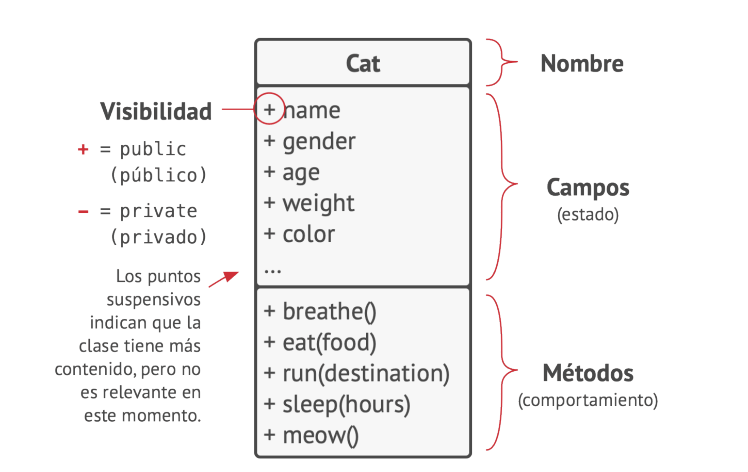
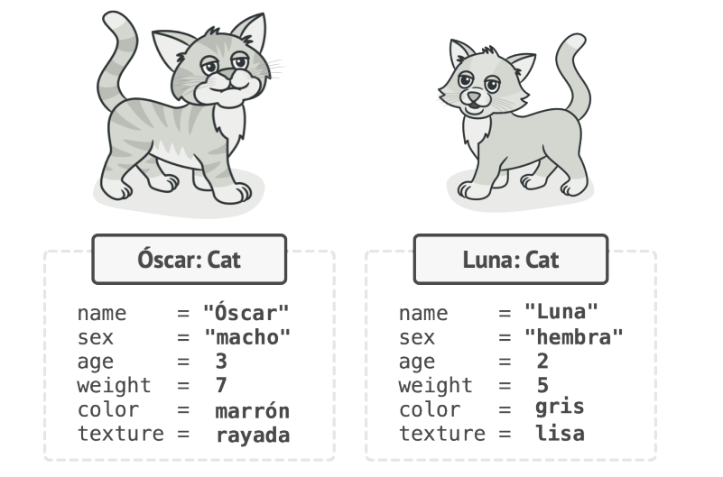
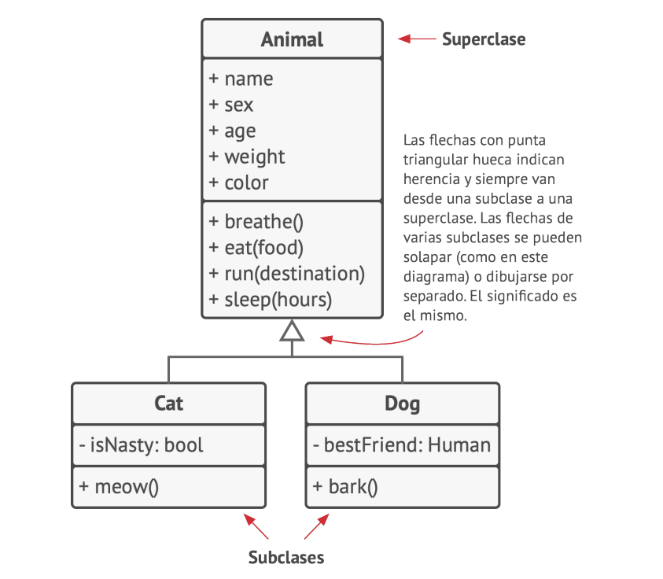
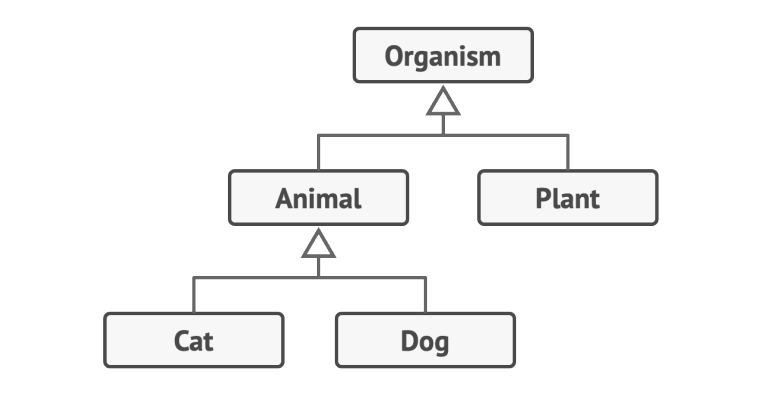
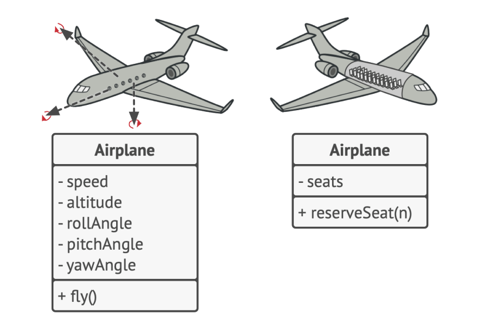
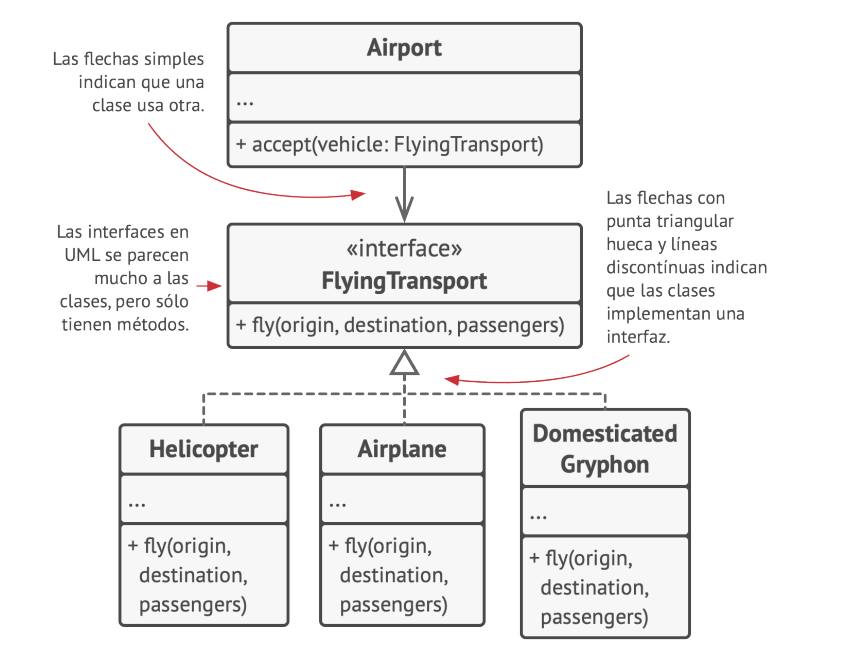
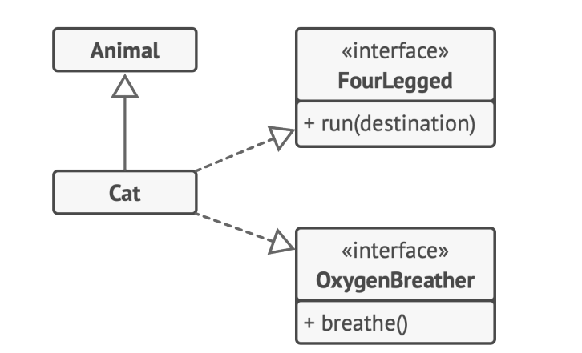
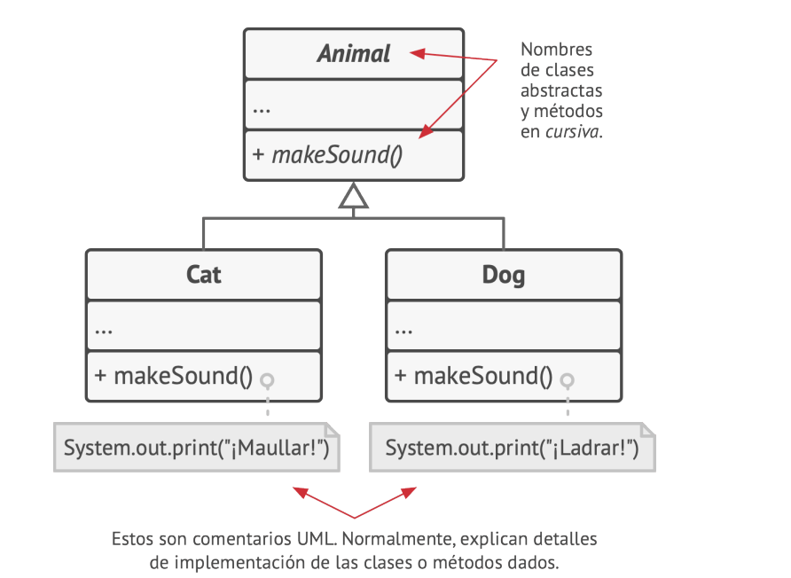

## Conceptos básicos de la programación orientada a objetos

La programación orientada a objetos (POO) es un paradigma basado en el concepto de envolver bloques de información y su comportamiento relacionado
en lotes especiales llamados **objetos**, que se construyen a partir de un grupo de 'planos' definidos por un programador, que se denominan **clases**. 




#### Objetos, clases 

Digamos que tienes un gato llamado Óscar. Óscar es un `objeto`, una instancia de la `clase` Gato. Cada gato tiene varios atributos estándar: nombre, sexo, edad, peso, color, comida favorita, etc. 
Estos son los campos de la clase. 

Además, todos los gatos se comportan de forma similar: respiran, comen, corren, duermen y maúllan. Estos son los métodos de la clase. 
Colectivamente, podemos referirnos a los campos y los métodos como los miembros de su clase.  

La información almacenada dentro de los campos del objeto suele denominarse estado y todos los métodos del objeto definen su comportamiento 
 
Luna, la gata de tu amigo, también es una instancia de la clase Gato. Tiene el mismo grupo de atributos que Óscar. La diferencia está en los valores de estos atributos: su sexo es hembra, 
tiene un color diferente y pesa menos.  




Por lo tanto, una clase es como un plano que define la estructura de los objetos, que son instancias concretas de esa clase. 

#### Jerarquías de clase 

Todo va muy bien mientras hablamos de una sola clase. Naturalmente, un programa real contiene más de una clase. Algunas de esas clases pueden estar organizadas en jerarquías de clase. 
Veamos lo que esto significa. 

Digamos que tu vecino tiene un perro llamado Fido. Resulta que perros y gatos tienen mucho en común: nombre, sexo, edad y color, son atributos tanto de perros como de gatos. 

Los perros pueden respirar, dormir y correr igual que los gatos, por lo que podemos definir la clase base `Animal` que enumera los atributos y comportamientos comunes. 




Una clase padre, como la que acabamos de definir, se denomina superclase. Sus hijas son las subclases. Las subclases heredan el estado y el comportamiento de su padre y se limitan a 
definir atributos o comportamientos que son diferentes. Por lo tanto, la clase `Gato` contendrá el método maullar y la clase `Perro` el método ladrar.  

Asumiendo que tenemos una tarea relacionada, podemos ir más lejos y extraer una clase más genérica para todos los Organismo vivos, que se convertirá en una superclase para `Animal` y `Planta` . 
Tal pirámide de clases es una **jerarquía**. En esta jerarquía, la clase `Gato` lo hereda todo de las clases `Animal` y `Organismo`. 




Las subclases pueden sobrescribir el comportamiento de los métodos que heredan de clases padre. Una subclase puede sustituir completamente el comportamiento por defecto o limitarse 
a mejorar con material adicional. 

###  Fundamentos de la programación orientada a objetos

La programación orientada a objetos se basa en cuatro pilares. Describamos cada uno de ellos.

#### Abstracción 

La mayoría de las veces, cuando creas un programa con POO, das forma a los objetos del programa con base a objetos del mundo real. 
Sin embargo, los objetos del programa no representan a los originales con una precisión del 100 % (y rara vez es necesario que lo hagan). 
En su lugar, los objetos tan solo copian atributos y comportamientos de objetos reales en un contexto específico, ignorando el resto.  

Por ejemplo, en una clase `Avión` probablemente podría existir un simulador de vuelo y en una aplicación de reserva de vuelos. 
Pero, en el primer caso, contendría información relacionada con el propio vuelo, mientras que en la segunda clase sólo habría que preocuparse del mapa de asientos 
y de los asientos que estén disponibles. 

**Distintos modelos del mismo objeto del mundo real.**



La abstracción es el modelo de un objeto, limitado a un contexto específico, que representa todos los datos relevantes con gran precisión, omitiendo el resto. 

#### Encapsulación 

Para arrancar el motor de un auto, tan solo debes girar una llave o pulsar un botón. No necesitas conectar cables, rotar el cigüeñal y los cilindros, e iniciar el ciclo de potencia del motor. 
Estos detalles se esconden de como suceden cuando funciona el auto. Sólo tienes una interfaz simple: un interruptor de encendido, un volante y unos pedales. 
Esto ilustra el modo en que cada objeto cuenta con una interfaz: una parte pública de un objeto, abierta a interacciones con otros objetos. 

La encapsulación es la capacidad que tiene un objeto de esconder partes de su estado y el comportamiento de otros objetos, exponiendo únicamente una interfaz limitada al resto del programa.  

Encapsular algo significa hacerlo privado y, por ello, accesible únicamente desde dentro de los métodos de su propia clase. 
Existe un modelo un poco menos restrictivo llamado protegido que hace que un miembro de una clase también esté disponible para las subclases. 

Las interfaces y las clases y métodos abstractos de la mayoría de los lenguajes de programación se basan en conceptos de abstracción y encapsulación. 
En los lenguajes modernos de programación orientada a objetos, el mecanismo de la interfaz te permite definir contratos de interacción entre objetos.  

Ésta es una de las razones por las que las interfaces sólo se interesan por los comportamientos de los objetos y también el motivo por el que no puedes declarar un campo en una interfaz. 

Imagina que tienes una interfaz `TransporteAéreo` con un método `vuelo(origen, destino, pasajeros)`. 




Al diseñar un simulador de transporte aéreo, puedes restringir la clase `Aeropuerto` para que sólo funcione con objetos que implementan la interfaz `TransporteAéreo` . 
Después de esto, tendrás la certeza de que cualquier objeto pasado a un objeto del aeropuerto, ya sea un avión, un helicóptero podrá aterrizar o despegar de este tipo de aeropuerto. 

Puedes cambiar la implementación del método `volar` en esas clases del modo que quieras, siempre y cuando la firma del método sea la misma que se declaró en la interfaz, todas 
las instancias de la clase `Aeropuerto` pueden funcionar bien con tus objetos voladores. 

#### Herencia 

La herencia es la capacidad de crear nuevas clases sobre otras existentes. La principal ventaja de la herencia es la reutilización de código. 
Si quieres crear una clase ligeramente diferente a una ya existente, no hay necesidad de duplicar el código. 
En su lugar, extiendes la clase existente y colocas la funcionalidad adicional dentro de una subclase resultante que hereda los campos y métodos de la superclase. 

La consecuencia del uso de la herencia es que las subclases tienen la misma interfaz que su clase padre. No puedes esconder un método en una subclase si se declaró en la superclase. 

También debes implementar todos los métodos abstractos, aunque no tengan sentido en tu subclase. 

**Diagrama UML de extensión de una única clase en comparación con la implementación de múltiples interfaces al mismo tiempo**



En la mayoría de los lenguajes de programación una subclase puede extender una única superclase. Por otro lado, cualquier clase puede implementar varias interfaces al mismo tiempo. 

Pero, como se mencionó antes, si una superclase implementa una interfaz, todas sus subclases deben implementarla también. 
 
#### Polimorfismo 

Veamos algunos ejemplos con animales. La mayoría de los Animal pueden emitir sonidos. Podemos anticipar que todas las subclases necesitarán sobrescribir el método base emitirSonido 
para que cada subclase pueda emitir el sonido correcto; por lo tanto, podemos declararlo abstracto directamente. Esto nos permite omitir cualquier implementación por 
defecto del método en la superclase, pero fuerza a todas las subclases a establecer las suyas propias. 


 
Imagina que ponemos varios gatos y perros dentro de una gran bolsa. Después, con los ojos tapados, vamos sacando los animalitos de la bolsa, de uno en uno. 
Al sacar un animalito, no sabemos con seguridad lo que es.  

Pero si lo abrazamos lo suficiente, el animalito emitirá un sonido específico de alegría, dependiendo de su clase concreta. 

 
``` 
bag = [new new Cat(), new Dog()]; 
foreach (Animal a : bag) 
a.makeSound() 
// ¡Miau! 
// ¡Guau! 
``` 
 
El programa no conoce el tipo concreto del objeto contenido dentro de la variable `a` pero, gracias al mecanismo especial llamado polimorfismo, el programa puede 
rastrear la subclase del objeto cuyo método está siendo ejecutado y ejecutar el comportamiento adecuado. 

El polimorfismo es la capacidad que tiene un programa de detectar la verdadera clase de un objeto e invocar su implementación, incluso aunque su tipo real sea desconocido en el  contexto actual.  
 
También puedes pensar en el polimorfismo como la capacidad de un objeto para `fingir` ser otra cosa, normalmente una clase que extiende o una interfaz que implementa. 
En nuestro ejemplo, los perros y gatos de la bolsa fingen ser animalitos genéricos. 

 
