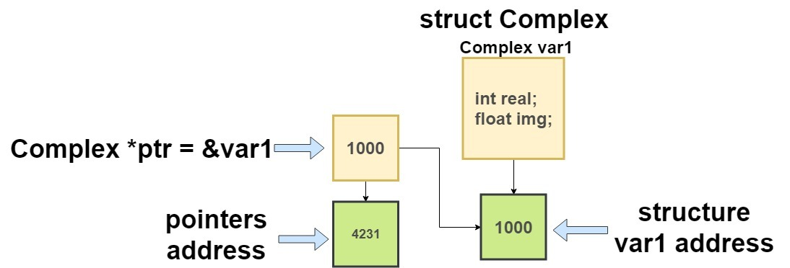
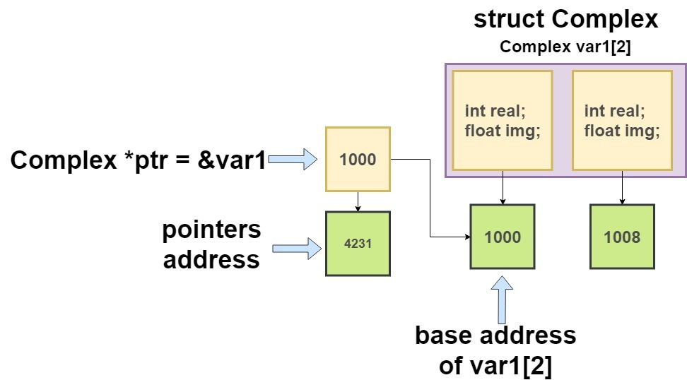
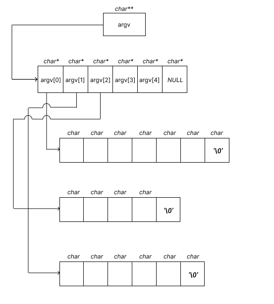

Algunas respuestas de la lista de ejercicios 7
----------------------------------------------

Clases
~~~~~~

Escribe una clase autosuficiente llamada ``Numero`` que mantenga un
``int``. Debe tener los siguientes métodos para realizar varias
operaciones en el ``int``:

-  ``void establecerNumero (int n);`` // establece n en int
-  ``int obtenerNumero( ) ;`` // devuelve el valor actual de int
-  ``void imprimirNumero( ) ;`` // imprime el int
-  ``bool esNegativo( ) ;`` // comprueba si int es negativo
-  ``bool esDivisiblePor(int n);`` // comprueba si int es divisible por
   n
-  ``int valorAbsoluto( ) ;`` // devuelve el valor absoluto de int

.. code:: c++

    #include <stdio.h>
    #include <iostream>
    using namespace std ;
    
    class Numero
    {
           private :
            int num ;
    
          public :
          void establecerNumero ( int n )
        {
           num = n ;
        }
         int obtenerNumero( )
        {
            return num ;
        }
        void imprimirNumero( )
        {
            cout << num << endl ;
             }
    
        bool esNegativo( )
        {
        if ( num < 0 )
          return true ;
        else
            return false ;
        }
        bool esDivisiblePor( int n )
        {
            if ( n == 0 )
                return false ;
            else
            {
                if ( num % n == 0 )
                    return true ;
            else
                return false ;
        }
           }
        int valorAbsoluto( )
        {
        if ( num >= 0 )
           return num ;
           else
           return -1 * num ;
        }
    };
    int main( )
    {
        Numero x ;
        x.establecerNumero ( 1234 ) ;
    
        x.imprimirNumero( ) ;
        if ( x.esDivisiblePor( 5 ) == true )
              cout << "5 divide " << x.obtenerNumero( ) << endl ;
        else
             cout << "5 no divide " << x.obtenerNumero( ) << endl ;
        cout << "Valor absoluto de " << x.obtenerNumero( ) << " is "
            << x.valorAbsoluto( ) << endl ;

Una clase autosuficiente significa que todos sus miembros están
definidos dentro de la clase. Aquí, los miembros de datos y las
funciones miembro de ``Numero`` se definen dentro de la clase.

Tal organización de la clase es sin duda factible, pero adolece de una
importante limitación. Si vamos a dar esta clase a otra persona,
entonces tendrá acceso al código fuente completo de la clase. Esto no es
deseable, especialmente cuando está desarrollando una biblioteca de
clases para que la usen otros.

¿Qué constructor es el constructor predeterminado? ¿Qué contiene su
cuerpo?

.. code:: c++

    #include <iostream>
    using namespace std ;
    
    class Muestra
    {
    };
    
    class Lanzamiento
    {
        public :
        Lanzamiento( )
        {
         cout << "Constructor de Lanzamiento de cero argumentos" ;
        }
    };
    int main( )
    {
        Muestra s ;
        Lanzamiento t ;
        
        return 0 ;
    }

Un constructor predeterminado es el constructor de cero argumentos en
una clase. Se llama constructor “predeterminado” porque si no lo
proporcionamos, el compilador insertaría un constructor público de cero
argumentos en la clase.

Aquí la clase ``Muestra`` no tiene constructor; por lo tanto, el
compilador insertaría un constructor de cero argumentos en él. Si el
compilador no hubiera hecho esto, no habríamos podido crear el objeto
``s``. En la clase ``Lanzamiento`` hemos definido el constructor de cero
argumento, por lo tanto, el compilador no proporcionaría uno.

¿El constructor realmente “construye” un objeto? ¿Se puede probar esto?

.. code:: c++

    #include <iostream>
    using namespace std ;
    
    class Muestra
    {
      public :
      
       Muestra( )
       {
          cout << "Direccion del objeto pasado a esta función = "
            << this << endl ;
        }
     };
    int main( )
    {
       Muestra s;
       cout << "Direccion del objeto  s = " << &s << endl ;
        return 0 ;
    }

Constructor no asigna espacio para un objeto. En ese sentido no
construye el objeto. Cuando creamos un objeto es en el enunciado

::

   Muestra s ; 

El compilador emite instrucciones equivalentes en lenguaje ensamblador
para asignar espacio para el objeto y llamar al constructor. Entonces,
el constructor se llama “después” de la asignación de espacio. Por lo
tanto, no “construye” el objeto.

Esto se puede probar a través del puntero ``this``. En el programa, la
dirección del objeto ``s`` se pasa al constructor y se recopila en el
puntero ``this``. Hemos impreso el contenido del puntero ``this``.

Puedes observar en la ejecución la dirección contenida en el puntero
``this`` es la misma que la dirección de ``s`` impresa en ``main()``.

Esto significa que para cuando el control aterriza en el constructor, el
objeto ya está creado. El constructor simplemente inicializa un objeto
ya creado a los valores deseados.

¿Puede una clase contener múltiples constructores? En caso afirmativo,
¿cómo se pueden crear y ser utilizados?

.. code:: c++

    #include <iostream>
    using namespace std ;
    
    class Muestra
    {
      private :
        int i ;
        float a ;
    
     public :
      Muestra( )
      {
        i=0;
        a = 0.0 ;
      }
      Muestra ( int j, float b )
      {
       i=j;
       a=b;
      }
       void imprimeData( )
      {
         cout << "i = " << i << " a = " << a << endl ;
      }
    };
    
    int main( )
    {
       Muestra s1, s2 ;
       Muestra s3 ( 10, 3.14 ), s4 ( 20, 6.28 ) ;
       s1.imprimeData( ) ;
       s2.imprimeData( ) ;
       s3.imprimeData( ) ;
       s4.imprimeData( ) ;
       
       return 0 ;
    }
    

Sí, una clase puede contener múltiples constructores. En La clase
``Muestra`` tenemos dos: un constructor de cero argumentos y un
constructor de dos argumentos. Dichos constructores se denominan
constructores sobrecargados. Se llama a un constructor adecuado en
función de los argumentos que le estamos pasando. Por ejemplo, para
``s1`` y ``s2`` se llama al constructor de cero argumentos, mientras que
para ``s3`` y ``s4`` se llama al constructor de dos argumentos.

¿Pueden los argumentos de un constructor tomar valores predeterminados?
En caso afirmativo, ¿para qué serviría?

.. code:: c++

    #include <iostream>
    using namespace std ;
    class Muestra
    
    {
      private :
       int i ;
       float a ;
    
      public :
       Muestra ( int j = 0, float b = 0.0 )
       {
        i=j;
        a=b;
      }
      void imprimirData( )
      {
        cout << "i = " << i << " a = " << a << endl ;
      }
    };
    int main( )
    {
     Muestra s1, s2 ;
     Muestra s3 ( 10, 3.14 ), s4 ( 20, 6.28 ) ;
     Muestra s5 ( 30 ), s6 ( 40 ) ;
     
     s1.imprimirData( ) ;
     s2.imprimirData( ) ;
     s3.imprimirData( ) ;
     s4.imprimirData( ) ;
     s5.imprimirData( ) ;
     s6.imprimirData( ) ;
     
     return 0 ;
    }

Un constructor puede tomar valores predeterminados para sus argumentos.
Mediante el uso de esta función, podríamos hacer el trabajo del
constructor de cero argumentos, así como el constructor de dos
argumentos en un solo constructor. Para ``s5`` y ``s6``, ``i`` se
configura con los valores que pasamos, mientras que ``a`` se configura
con el valor 0.0.

¿Cuál es el papel de un puntero **this** en un constructor?

.. code:: c++

    #include <iostream>
    using namespace std ;
    
    class Muestra
    
    {
      private :
       int i ;
       float a ;
      public :
       Muestra ( int i = 0, float a = 0.0 )
      {
         cout << "Direccion del objeto = " << this << endl ;
         this->i = i ;
         this->a = a ;
      }
       void imprimirData( )
       {
         cout << endl << "Direccion del objeto = " << this << endl ;
         cout << "i = " << i << " a = " << a << endl ;
       }
    };
    int main( )
    {
       Muestra s1, s2 ;
       Muestra s3 ( 10, 3.14 ), s4 ( 20, 6.28 ) ;
       s1.imprimirData( ) ;
       s2.imprimirData( ) ;
       s3.imprimirData( ) ;
       s4.imprimirData( ) ;
       
       return 0 ;
    }

Un puntero ``this`` siempre se pasa al constructor. Contiene la
dirección del objeto que se está construyendo durante esa llamada.

Si los nombres de los argumentos y los nombres de las variables privadas
son los mismos, entonces usando el puntero ``this`` podemos distinguir
entre variables privadas y los argumentos. Las que se utilizan con el
puntero ``this`` son variables privadas.

¿Cómo se define un constructor copia?

.. code:: c++

    #include <iostream>
    using namespace std ;
    class Circulo
    {
     private :
       int radio ;
       float x, y ;
    public :
    
      Circulo( )
      { 
      }
        Circulo ( int rr, float xx, float yy )
       {
         radio = rr ;
         x = xx ;
         y = yy ;
       }
    
       Circulo ( Circulo& c )
       {
         cout << "Constructor copia invocado" << endl ;
          radio = c.radio ;
          x = c.x ;
          y = c.y ;
    
       }
       void muestraData( )
      {
        cout << "Radio = " << radio << endl ;
        cout << "X-Coordenada = " << x << endl ;
        cout << "Y-Coordenada = " << y << endl ;
      }
    };
    int main( )
    {
      Circulo c1 ( 10, 2.5, 3.5 ) ;
      Circulo c2 = c1 ;
      Circulo c3 ( c1 ) ;
    
      c1.muestraData( ) ;
      c2.muestraData( ) ;
      c3.muestraData( ) ;
      return 0 ;
    }

Aquí el objeto ``c1`` se construye a través del constructor de tres
argumentos. Los objetos ``c2`` y ``c3`` se construyen a través del
constructor de copias. ``c2`` y ``c3`` no se pueden construir a través
del constructor normal de tres argumentos ya que también se inicializan
donde están definidos. Ten en cuenta las diferentes formas de
inicialización de ``c2`` y ``c3``. Ambos dan como resultado una llamada
al constructor de copias.

Además, ten en cuenta que durante ambas llamadas, ``c1`` se pasa al
constructor de copias por referencia. ¿Es necesario que usemos una
referencia en el argumento al constructor de copias? ¿No podemos pasar
un valor en su lugar? No. Porque, si pasamos el argumento por valor, su
copia se construye utilizando el constructor de copias. Esto significa
que el constructor de copias se llamaría a sí mismo para hacer esta
copia. Este proceso continuaría hasta que el compilador se quede sin
memoria. Por lo tanto, en el constructor de copias, el argumento siempre
debe pasarse por referencia.

Por último, si no proporcionamos el constructor de copias, el compilador
lo proporcionará.

¿Para qué sirve un constructor copia y en qué se diferencia de un
constructor normal?

.. code:: c++

    #include <iostream>
    using namespace std ;
    
    class Circulo
     {
      private :
        int radio ;
        float x, y ;
    
      public :
       Circulo( )
       {
        radio = x = y = 0 ;
       }
        Circulo ( int rr, float xx, float yy )
        {
         radio = rr ;
         x = xx ;
         y = yy ;
       }
       Circulo ( const Circulo& c )
       {
       cout << "Constructor copia invocado" << endl ;
       radio = c.radio ;
       x = c.x ;
       y = c.y ;
       }
       void muestraData( )
       {
        cout << "Radio = " << radio << endl ;
        cout << "X-Coordenada = " << x << endl ;
        cout << "Y-Coordenada = " << y << endl ;
       }
       void colocaData ( Circulo c )
      {
       radio = c.radio ;
       x = c.x ;
       y = c.y ;
       }
    };
    
    Circulo fun( )
    {
       Circulo c ;
       return c ;
    }
    
    int main( )
    {
       Circulo c1 ( 10, 2.5, 3.5 ) ;
       Circulo c2 = c1 ;
       c2.muestraData( ) ;
       Circulo c3 ;
    
       c3.colocaData ( c1 ) ;
       c3.muestraData( ) ;
      
       Circulo c4 = fun( ) ;
       c4.muestraData( ) ;
       return 0 ;
    }

Un constructor de copias se invoca en tres situaciones. Estos son los
siguientes:

(a) Al instanciar un objeto e inicializarlo con valores de otro objeto.

(b) Al pasar un objeto a una función por valor.

(c) Cuando se devuelve un objeto de una función por valor.

Cuando un objeto se pasa por valor, la copia en la que opera la función
se crea utilizando un constructor de copia. Si pasamos la dirección o
referencia del objeto, por supuesto no se invocaría el constructor de
copias, ya que en estos casos no se van a crear las copias de los
objetos.

Cuando se devuelve un objeto desde una función, se invoca al constructor
de copias para crear una copia del valor devuelto por la función.

Sin embargo, a partir de la ejecución vemos que el constructor de copia
se llama solo dos veces: al inicializar ``c2`` y al pasar ``c1`` a la
función ``colocaData()``. Contrariamente a la expectativa, no se llama
cuando se crea ``c4``. Esto se debe a que el compilador realiza una
“optimización del valor de retorno” y elimina la llamada al constructor
de copias para crear una copia del objeto.

Sin embargo, en algunos casos el compilador no puede realizar esta
optimización. Por ejemplo, si cambia la definición a ``fun()`` como se
muestra a continuación y vuelves a ejecutar el programa, encontrarás que
esta vez se llama al constructor de copias mientras devuelve un objeto
de ``fun()``.

::

   Circulo fun( ) 
   { 
     Circulo cthis, cthat ; 
      int i = 0 ; 
        return ( i ? cthis : cthat ) ; 
   }

Escribe un programa para crear la clase ``Muestra`` como una clase
``Singleton``. Una clase ``Singleton`` es una clase a partir de la cual
solo se puede crear un objeto.

.. code:: c++

    #include <iostream>
    using namespace std ;
    
    class Singleton
    {
      private:
       int i ;
       static Singleton *p ;
       Singleton( )
      {
        i=0;  
    }
      public:
      static Singleton* create( )
     {
      if ( p == NULL )
        p = new Singleton ;
       return p ;
      }
    };
    
    Singleton* Singleton :: p = NULL ;
    int main( )
    
    {
       Singleton *s1, *s2, *s3 ;
       s1 = Singleton :: create( ) ;
       s2 = Singleton :: create( ) ;
       s3 = Singleton :: create( ) ;
    
      cout << s1 << endl ;
      cout << s2 << endl ;
      cout << s3 << endl ;
      
      return 0 ;
    }

Hemos declarado privado al constructor de la clase ``Singleton``. Como
resultado, no se puede llamar desde fuera de la clase. Luego,
proporcionamos una función de fábrica llamada ``create()`` y la marcamos
como estática. Esto significa que para llamarlo no necesitamos un
objeto. Simplemente podemos llamarlo usando la sintaxis
``Singleton :: create()``. También hemos creado un puntero estático
``p`` y lo inicializamos en ``NULL``.

En la función ``create()`` hemos creado un objeto de clase ``Singleton``
solo si ``p`` es ``NULL``. ``p`` sería ``NULL`` cuando lleguemos a
``create()`` por primera vez. Durante las llamadas posteriores a
``create()``, ``p`` no sería ``NULL``, por lo que no creamos ningún
objeto adicional.

Crear una clase llamada ``Jugador``. Los atributos de esta clase serán
la posición x y la posición y, en donde ambos son enteros y representan
la posición actual del jugador. Además de un atributo llamado ``pasos``
que representa la cantidad de pasos máximos que puede dar el jugador.

Crear una método ``Mover(int Direccion)``. El parámetro ``Direccion``
define el tipo de movimiento que realizamos. Este método será llamado
constantemente hasta que la cantidad de pasos se acabe, y el argumento
que recibirá será 4, 8, 6 o 2 ingresado por el usuario. El valor 4 será
para un movimiento hacia la izquierda, el 8 para arriba, el 6 para la
derecha y el 2 para abajo.

.. code:: c++

    // Pregunta y código de Pierre Ruiz
    #include <iostream>
    using namespace std;
    class Jugador{
        int x = 0;
        int y = 0;
        int pasos = 10;
        
        public:
            Jugador();
        
            Jugador(int x, int y, int pasos = 10);
        
            void Mover(int Direccion);
        
            int GetPasos() { return pasos; }
        
            void ImprimirPosicionActual();
    };
    int main(){
        Jugador* jugador = new Jugador();
        cout << "Bienvenido al juego!\nPor favor siga las siguientes instrucciones:\n";
        cout << "Controles:\n2->Mover abajo\n4->Mover izquierda\n6->Mover derecha\n8->Mover arriba\n";
        int turnos = 0;
        while(turnos < jugador->GetPasos()){
            int Direccion;
            cout << "Ingrese un valor: "; cin >> Direccion;
            while(Direccion!= 4 && Direccion!= 8 && Direccion!=6 && Direccion!=2){
                cout << "Error: El valor ingresado no esta presente en el menu\nIngrese un valor: "; cin >> Direccion;
            }
            jugador->Mover(Direccion); 
        }
        cout << "El juego ha finalizado";
    }
    
    Jugador::Jugador(){ } 
    
    Jugador::Jugador(int x, int y, int pasos){
        this->x = x;
        this->y = y;
        this->pasos = pasos;
    }
    
    void Jugador::Mover(int Direccion){
        switch(Direccion){
            case 4: x-=1; break;
            case 6: x+=1; break;
            case 8: y+=1; break;
            case 2: y-=1; break;
            default: break;
        }
        pasos -= 1;
        ImprimirPosicionActual();
    }
    
    void Jugador::ImprimirPosicionActual(){
       cout << "(" << x << ", " << y << ")\n";
    }

Crear una clase llamada ``Enemigo``, Los atributos de esta clase, al
igual que la anterior, tendrán la posición ``x`` y posición ``y``
representando la posición actual del enemigo. Sin embargo, el enemigo no
tendrá una cantidad máxima de pasos, es decir, se podrá mover cuanto
quiera. Crear un método ``Mover(int Direccion)`` que tiene una
funcionalidad igual al de la clase ``Persona`` y se llamará al final de
cada movimiento que realice la persona, en donde el valor del parámetro
``Direccion`` será dado de forma aleatoria.

.. code:: c++

    // Pregunta y código de Pierre Ruiz
    
    #include <iostream>
    #include <time.h>
    #include <stdlib.h>
    using namespace std;
    class Jugador{
        int x = 0;
        int y = 0;
        int pasos = 10;
        
        public:
            Jugador(){ }
            Jugador(int x, int y, int pasos = 10);
            void Mover(int Direccion);
            int GetPasos() { return pasos; }
            void ImprimirPosicionActual();
    };
    class Enemigo{
        int x = 0;
        int y = 0;
        
        public:
            Enemigo(){ }
            Enemigo(int x, int y);
            void Mover(int Direccion);
            void ImprimirPosicionActual();
    };
    int main(){
        srand(time(NULL));
        
        Jugador* jugador = new Jugador();
        Enemigo* enemigo = new Enemigo(1 + rand()%10, 1 + rand()%20);
        cout << "Bienvenido al juego!\nPor favor siga las siguientes instrucciones:\n";
        cout << "Controles:\n2->Mover abajo\n4->Mover izquierda\n6->Mover derecha\n8->Mover arriba\n";
        
        cout << "Posicion del enemigo: "; enemigo->ImprimirPosicionActual();
        while(0 < jugador->GetPasos()){
            int Direccion;
            cout << "Ingrese un valor: "; cin >> Direccion;
            while(Direccion!= 4 && Direccion!= 8 && Direccion!=6 && Direccion!=2){
                cout << "Error: El valor ingresado no esta presente en el menu\nIngrese un valor: "; cin >> Direccion;
            }
            jugador->Mover(Direccion);
    
        enemigo->Mover(1 + rand()%4);  
        }
        cout << "El juego ha finalizado";
    }
    
    Jugador::Jugador(int x, int y, int pasos){
        this->x = x;
        this->y = y;
        this->pasos = pasos;
    }
    
    void Jugador::Mover(int Direccion){
        switch(Direccion){
            case 4: x-=1; break;
            case 6: x+=1; break;
            case 8: y+=1; break;
            case 2: y-=1; break;
            default: break;
        }
        pasos -= 1;
        ImprimirPosicionActual();
    }
    
    void Jugador::ImprimirPosicionActual(){
        cout << "(" << x << ", " << y << ")\n";
    }
    
    Enemigo::Enemigo(int x, int y){
        this->x = x;
        this->y = y;
    } 
    
    void Enemigo::Mover(int Direccion){
        switch(Direccion){
            case 1: x-=1; break;
            case 2: x+=1; break;
            case 3: y+=1; break;
            case 4: y-=1; break;
            default: break;
        }
        ImprimirPosicionActual();
    }
    
    void Enemigo::ImprimirPosicionActual(){
        cout << "(" << x << ", " << y << ")\n";
    }

Crear un método ``Disparar(int Dirección)`` que dispare una bala desde
la posición del jugador según la dirección asignada. Además. crear un
menú para seleccionar la acción del jugador a realizar. Si el jugador va
a moverse o disparar. Tener en cuenta que este menú aparecerá al inicio
de cada turno del jugador y solo podrá realizar una de las dos acciones
en cada turno.

.. code:: c++

    // Pregunta y código de Pierre Ruiz
    #include <iostream>
    #include <time.h>
    #include <stdlib.h>
    using namespace std;
    class Enemigo{
        int x = 0;
        int y = 0;
        bool vivo = true;
        
        public:
            Enemigo(){ }
            Enemigo(int x, int y);
            void Mover(int Direccion);
            void ImprimirPosicionActual();
            void ChangeVivo() { vivo = !vivo; }
            bool GetVivo() { return vivo; }
            int GetX() { return x; }
            int GetY() { return y; }
    };
    class Jugador{
        int x = 0;
        int y = 0;
        int pasos = 20;
        
        public:
            Jugador(){ }
            Jugador(int x, int y, int pasos = 20);
            void ElegirAccion(int Accion, int Direccion, Enemigo* enemigo);
            void Mover(int Direccion);
            int GetPasos() { return pasos; }
            void ImprimirPosicionActual();
            void Disparar(int Direccion, Enemigo* enemigo);
    };
    
    int main(){
        srand(time(NULL));
        Jugador* jugador = new Jugador();
        Enemigo* enemigo = new Enemigo(1 + rand()%10, 1 + rand()%20);
        cout << "Bienvenido al juego!\nPor favor siga las siguientes instrucciones:\n";
        cout << "Eleccion de accion:\n1->Mover\n2->Disparar\n";
        cout << "Direccion de la accion:\n2->Abajo\n4->Izquierda\n6->Derecha\n8->Arriba\n";
        cout << "Posicion del enemigo: "; enemigo->ImprimirPosicionActual();
        while(0 < jugador->GetPasos()){
            int Accion;
            int Direccion;
            cout << "Ingrese la acción a realizar: "; cin >> Accion;
            while(Accion != 1 && Accion != 2){
                cout << "Error: El valor ingresado para la accionno esta presente en el menu\nIngrese un valor: "; cin >> Accion;
            }
            cout << "Ingrese la direccion: "; cin >> Direccion;
            while(Direccion!= 4 && Direccion!= 8 && Direccion!=6 && Direccion!=2){
                cout << "Error: El valor ingresado para la direccion no esta presente en el menu\nIngrese un valor: "; cin >> Direccion;
            }
            jugador->ElegirAccion(Accion, Direccion, enemigo);
            if(!enemigo->GetVivo()){
                cout << "¡Felicidades!, has eliminado al enemigo\n";
                break;
            }
            enemigo->Mover(1 + rand()%4);  
        }
        cout << "El juego ha finalizado";
    }
    
    Jugador::Jugador(int x, int y, int pasos){
        this->x = x;
        this->y = y;
        this->pasos = pasos;
    }
    
    void Jugador::ElegirAccion(int Accion, int Direccion, Enemigo* enemigo){
        if(Accion == 1){
            Mover(Direccion);
            return;
        }
        Disparar(Direccion, enemigo);
    } 
    
    void Jugador::Mover(int Direccion){
        switch(Direccion){
            case 4: x-=1; break;
            case 6: x+=1; break;
            case 8: y+=1; break;
            case 2: y-=1; break;
            default: break;
        }
        pasos -= 1;
        ImprimirPosicionActual();
    }
    
    void Jugador::Disparar(int Direccion, Enemigo* enemigo){
        switch(Direccion){
            case 4: 
                if(y != enemigo->GetY()){ return; }
                    if(x - enemigo->GetX() > 0 ){
                        enemigo->ChangeVivo();
            }
            break;
            case 6:
                if(y != enemigo->GetY()){ return; }
                   if(x - enemigo->GetX() < 0 ){
                    enemigo->ChangeVivo();
            }
            break;
            case 2:
                if(x != enemigo->GetX()){ return; }
                    if(y - enemigo->GetY() > 0 ){
                        enemigo->ChangeVivo();
                }
            break;
            case 8:
                if(x != enemigo->GetX()){ return; }
                    if(y - enemigo->GetY() < 0 ){
                        enemigo->ChangeVivo();
                }
                break;
        }
    }
    
    void Jugador::ImprimirPosicionActual(){
        cout << "(" << x << ", " << y << ")\n";
    }
    
    Enemigo::Enemigo(int x, int y){
        this->x = x;
        this->y = y;
    } 
    
    void Enemigo::Mover(int Direccion){
        switch(Direccion){
            case 1: x-=1; break;
            case 2: x+=1; break;
            case 3: y+=1; break;
            case 4: y-=1; break;
            default: break;
        }
        ImprimirPosicionActual();
    }
    
    void Enemigo::ImprimirPosicionActual(){
        cout << "(" << x << ", " << y << ")\n";
    }

Estructuras
~~~~~~~~~~~

Escribe el código apropiado para la siguiente figura:

Un puntero de estructura es un tipo de puntero que almacena la dirección
de una variable de tipo estructura. Como puedes ver en el diagrama
anterior, tenemos una estructura llamada ``Complex`` con 2 miembros de
datos (uno de tipo entero y otro de tipo flotante).

Cuando creamos una variable de esta estructura (``Complex var1``), se le
asigna un espacio de memoria. Ahora se puede acceder a esta memoria
creando un puntero del mismo tipo de estructura que se muestra en el
diagrama (``Complejo *ptr``). Ahora este puntero puede señalar la
dirección de memoria real de la variable de estructura ``var1`` y puede
acceder a sus valores.

.. code:: c++

    #include <iostream>
    using namespace std;
    struct Complex
    {
     int real;
     float img;
    };
    
    int main()
    {
    
      Complex var1;
      Complex* ptr = &var1;
      
      var1.real = 1000;
      var1.img = 4231.2;
     
     cout<<"Parte real: "<<ptr->real<<endl;
     cout<<"Parte imaginaria: "<<ptr->img;
     
     return 0;
    }

Escribe el código apropiado para la siguiente figura:

Como se muestra en el diagrama anterior, hemos creado un arreglo de tipo
de estructura Complex de tamaño 2. Luego creamos un puntero de tipo de
estructura ``Complex`` y asignamos la dirección del arreglo ``var1`` a
este puntero. Ahora el puntero ``*ptr`` contiene la dirección del primer
elemento en el arreglo de estructura ``var1`` y podemos usar el puntero
para acceder a todos los elementos dentro del arreglo iterando el
puntero usando ``ptr++``.

.. code:: c++

    #include <iostream>
    using namespace std;
    struct Complex
    {
     int real;
     float img;
    };
    
    int main()
    {
     
      Complex var1[2];
      Complex *ptr;
      ptr=var1;
    
      var1[0].real = 5;
      var1[0].img = 1.33;
      var1[1].real = 11;
      var1[1].img = 1.56; 
      
     
     for(int i=0;i<2;i++)
     {
        cout<<"Parte real de un elemento del arreglo"<<(i+1)<<" : "<<(ptr+i)->real<<endl;
     cout<<"Parte imaginaria de un elemento del arreglo"<<(i+1)<<" : "<<(ptr+i)->img<<endl;
     }
      
     return 0;
    }

Escribe un programa para acceder a los miembros de la estructura
utilizando los operadores de puntero a miembro, .\* y ->*.

.. code:: c++

    #include <iostream>
    using namespace std ;
    
    struct muestra
    {
        int a ;
        float b ;
    };
    
    int main( )
    {
        muestra so = { 10, 3.14f } ;
        int muestra::*p1 = &muestra::a ;
    
        float muestra::*p2 = &muestra::b ;
        cout << so.*p1 << "\t" << so.*p2 << endl ;
    
        muestra *sp ;
        sp = &so ;
        cout << sp->*p1 << "\t" << sp->*p2 << endl ;
    
        so.*p1 = 20 ;
        sp->*p2 = 6.28f ;
        cout << so.*p1 << "\t" << so.*p2 << endl ;
        cout << sp->*p1 << "\t" << sp->*p2 << endl ;
        muestra soarr[ ] = {
            { 30, 9.22f },
            { 40, 7.33f },
            { 60, 8.88f }
        };
        for ( int i =0 ; i <= 2 ; i++ )
            cout << soarr[ i ].*p1 << "\t" << soarr[ i ].*p2 << endl ;
         return 0 ;
    }

Para realizar el acceso y la desreferenciación simultáneamente, C++
proporciona dos operadores: ‘.\ *’ y ’->*’. Estos se conocen como
punteros a operadores miembro. Ten en cuenta la definición de los
punteros p1 y p2:

::

   int muestra::*p1 = &muestra::a ;
   float muestra ::*p2 = &muestra::b

Considera la parte antes del operador de asignación. Las estrellas
indican que ``p1`` y ``p2`` son punteros. ``muestra::`` indica que son
punteros a un ``int`` y un ``float`` dentro de ``muestra``. También
hemos inicializado estos punteros al declararlos, con direcciones de
``a`` y ``b`` respectivamente.

Hablando en serio, no hay una “dirección de” ``muestra::a`` porque
estamos refiriéndonos a una clase y no a un objeto de esa clase.
``&muestra::a`` simplemente produce un desplazamiento en la clase. La
dirección real se produciría cuando combinamos ese
desplazamiento(offset) con la dirección inicial de un objeto en
particular.

Por lo tanto, ``&muestra::a`` no es más que la sintaxis de puntero a
miembro. Si usamos ``p1`` y ``p2`` con un objeto, obtendríamos un
conjunto de valores, si lo usamos con otro, obtendríamos otro conjunto
de valores. Esto es lo que se muestra hacia el final del programa, donde
construimos un arreglo de objetos y accedimos a todos los elementos de
los objetos usando ``p1`` y ``p2``. La moraleja es que los punteros a
los miembros no están enlazados a ningún objeto específico.

En el lado izquierdo de ``'.*'`` siempre habría una variable de
estructura (objeto) o una referencia y en el lado izquierdo de ``'->*'``
habría ser siempre un puntero a una estructura (objeto).

Declara el dato de tipo estructura Estudiante conformada por los
miembros:

-  nombre, una cadena de capacidad 20 para guardar el primer nombre de
   un alumno del curso de Fundamentos de Programación.
-  nota del tipo int para almacenar la nota del laboratorio calificado 5
   del alumno.

Ingresa la cantidad de estructuras n a generar. Luego, declara e
inicializa un arreglo de n estructuras del tipo Estudiante e imprime
dicho arreglo. Finalmente, imprime la mayor nota.

Ejemplo:

::

   Ingresa la cantidad de estudiantes a ingresar:

   Nombredelestudiante:kapu
   Nombredelestudiante:chalito
   Nombre del estudiante: tomo
                       Nombre        Nota     
   Nro 0 :              kapu           1
   Nro 1 :              chalito        4
   Nro 2 :              tomo           9 
   Nota máxima: 9

.. code:: c++

    #include <iostream>
    #include <iomanip>
    using namespace std;
    const int CAPACIDAD = 20;
    
    typedef struct {
        char nombre[CAPACIDAD];
        int nota;
    } Estudiante;
    
    void ingresar(Estudiante* ptr, int cap);
    void mostrar(Estudiante* ptr, int cap);
    
    int main() {
        Estudiante* ptr = nullptr;
        int n = 0;
        cout << "ingrese la cantidad de estudiantes a ingresar\t:\t"; cin >> n; cin.get();
        ptr = new Estudiante[n];
        ingresar(ptr, n);
        mostrar(ptr, n);
        delete[] ptr; ptr = nullptr;
    }
    
    void ingresar(Estudiante* ptr, int cap) {
        for (int j = 0; j < cap; ++j) {
            ptr[j].nota = rand()%21;
            cout << "nombre del estudiante\t:\t";
            cin >> ptr[j].nombre;
        }
    }
    
    void mostrar(Estudiante* ptr, int cap) {
        int max = -1;
        cout << "\t\t\t" << setw(CAPACIDAD) << "Nombre" << "\t\tNota\n";
        for (int j = 0; j < cap; ++j) {
            cout << "Nro " << j << "\t:\t" << setw(CAPACIDAD) << ptr[j].nombre << "\t\t" << ptr[j].nota << endl;
            if (ptr[j].nota > max) max = ptr[j].nota;
        }
        cout << "Nota maxima\t:\t" << max << endl;
    }

Estás ejecutando un sitio web y estás tratando de realizar un
seguimiento de cuánto dinero gana por día con la publicidad. Declara una
estructura publicitaria que realice un seguimiento de cuántos anuncios
has mostrado a los lectores, en qué porcentaje de anuncios hicieron clic
los usuarios y cuánto ganastes en promedio por cada anuncio en el que se
hizo clic. Lee los valores para cada uno de estos campos del usuario.
Pasa la estructura publicitaria a una función que imprima cada uno de
los valores y luego calcula cuánto ganastes ese día.

.. code:: c++

    #include <iostream>
    
    struct Publicidad
    {
        int anunciosMostrados {};
        double tasaPorcentajeClickUsuarios {};
        double promedioGananciaClick {};
    };
    
    Publicidad obtenerPublicidad()
    {
       Publicidad temp;
        std::cout << "¿Cuantos anuncios se mostraron hoy? ";
        std::cin >> temp.anunciosMostrados;
        std::cout << "¿Qué porcentaje de anuncios hicieron clic los usuarios? ";
        std::cin >> temp.tasaPorcentajeClickUsuarios;
        std::cout << "¿Cuál fue el promedio de ganancias por clic? ";
        std::cin >> temp.promedioGananciaClick;
        return temp;
    }
    
    void imprimirPublicidad(constPublicidad& ad)
    {
        std::cout << "Numero de anuncios mostrados: " << ad.anunciosMostrados << '\n';
        std::cout << "Clic por calificaciones: " << ad.tasaPorcentajeClickUsuarios << '\n';
        std::cout << "Ganancias promedio por clic:" << ad.promedioGananciaClick << '\n';
    
        std::cout << "Ganancias totales: " <<
            (ad.anunciosMostrados * ad.tasaPorcentajeClickUsuarios / 100 * ad.promedioGananciaClick) << '\n';
    }
    
    int main()
    {
       Publicidad ad{ obtenerPublicidad() };
        imprimirPublicidad(ad);
    
        return 0;
    }

Archivos
~~~~~~~~

Escribe un programa en C++ para leer y escribir operaciones de archivos
con funciones de manejo de archivos.

.. code:: c++

    #include <iostream>
    #include <fstream>
    #include <string>
    
    int main() {
        std::ofstream outFile; 
        outFile.open("archivos1.txt"); 
    
        if (!outFile) {
            std::cerr << "No se puede abrir el archivo para escritura." << std::endl;
            return 1;
        }
    
        outFile << "Hola a todos!" << std::endl; 
        outFile << "Esta es un archivo de muestra." << std::endl;
        outFile.close(); 
    
        std::ifstream inFile; 
        inFile.open("archivos1.txt"); 
    
        if (!inFile) {
            std::cerr << "No se puede abrir el archivo por lectura." << std::endl;
            return 1;
        }
    
        std::string linea;
        while (std::getline(inFile, linea)) { 
            std::cout << linea << std::endl; 
        }
    
        inFile.close(); 
        return 0;
    }

Escribe un programa en C++ para leer un archivo de texto y escribirlo en
otro archivo de texto utilizando funciones de archivos.

.. code:: c++

    #include <iostream>
    #include <fstream>
    #include <string>
    
    int main() {
        std::ifstream inFile; 
        inFile.open("entrada.txt"); 
        if (!inFile) {
            std::cerr << "No se puede abrir el archivo de entrada." << std::endl;
            return 1;
        }
    
        std::ofstream outFile; 
        outFile.open("salida.txt"); 
    
        if (!outFile) {
            std::cerr << "No se puede abrir el archivo de salida." << std::endl;
            return 1;
        }
    
        std::string linea;
        while (std::getline(inFile, linea)) { 
            outFile << linea << std::endl; 
        }
    
        std::cout << "Archivo copiado." << std::endl;
    
        inFile.close();
        outFile.close(); 
    
        return 0;
    }

Escribe un programa que lea una matriz ``m × n``, ``A = (aij )`` de un
archivo de texto con ``m`` líneas es una lista de ``n`` entradas dobles
separadas por un espacio, luego emite el sistema homogéneo

``Ax= 0`` en forma algebraica explícita con ``m`` líneas de texto con el
siguiente formato:

::

   ai1 * x[1] + . . . ain * x[n].

El nombre del archivo que contiene la matriz y el número entero ``n``
debe leerse desde la línea de comando.

Por ejemplo, para el archivo de texto:

::

   1 -2.3 3 0.0
   -9.123 2 -50 -1

debes obtener el siguiente resultado:

::

   x[1] - 2.3*x[2] + 3*x[3] = 0
   -9.123*x[1] + 2*x[2] - 50*x[3] - x[4] = 0

.. code:: c++

    // Respuesta dada por Leo Liberti
    
    // .... archivo.txt 4
    #include <iostream>
    #include <fstream>
    #include <cmath>
    int main(int argc, char** argv) {
        using namespace std;
        if (argc < 3) {
          cerr << "error: archivo necesario conteniendo una matriz m x n y el entero n" 
            << "\n en la linea de comandos" << endl;
          exit(1);
        }
        ifstream ifs(argv[1]);
        if (!ifs) {
            cerr << "error: no puedes abrir el archivo " << argv[1] << endl;
            exit(2);
        }
        
        int n = atoi(argv[2]);
        double t;
        int i = 1;
        char c;
        bool firstTerm = true;
        while(true) {
           ifs.get(c);
           ifs >> t;
           if (ifs.eof()) {
              break;
           }
            if (t != 0) {
                if (t < 0) {
                    if (firstTerm) {
                        cout << "-";
                    } else {
                        cout << " - ";
                }
                if (fabs(t) != 1) {
                    cout << fabs(t) << "*";
                }
                cout << "x[" << i << "]";
            } else {
                if (!firstTerm) {
                    cout << " + ";
                }
                if (t != 1) {
                    cout << t << "*";
                }
                cout << "x[" << i << "]";
    
            }
        }
        firstTerm = false;
        i++;
        if (i > n) {
            i = 1;
            firstTerm = true;
            cout << " = 0" << endl;
            }
        }
        return 0;
    }

**Repaso**

Aprendimos mucho sobre cómo pasar parámetros en funciones anteriormente.
Descubrimos además por qué se pasan los parámetros y qué obtenemos a
cambio de las funciones. Sin embargo, a menudo no proporcionamos ningún
argumento o parámetro a la función ``main()``.

En muchos IDE y compiladores de C++, cuando se genera la función
``main`` se ve así:

::

   int main(int argc, char *argv[])

Cuando se codifica C++ sin un IDE, solo con un compilador de línea de
comandos se escribe (a veces):

::

   int main()

En los programas C++, también podemos pasar los parámetros en la función
``main()``. Estos parámetros se denominan argumentos de línea de comando
o parámetros de línea de comando. Estos dos parámetros son ``argc`` y
``argv``.

Expliquemos los términos ``argv`` y ``argc`` que son parte de cómo se
pasan los argumentos de la línea de comandos a ``main()`` en C y C++.

``argc`` será el número de cadenas apuntadas por ``argv``. Esto será (en
la práctica) 1 más el número de argumentos, ya que prácticamente todas
las implementaciones antepondrán el nombre del programa al arreglo.

Las variables se denominan ``argc`` (recuento de argumentos) y ``argv``
(vector de argumento) por convención, pero se les puede dar cualquier
identificador válido:

::

   int main(int num_args, char** arg_strings)

es igualmente válido.

También se puedes omitir por completo, dando como resultado
``int main()``, si no tienes la intención de procesar los argumentos de
la línea de comandos.

Prueba el siguiente programa:

.. code:: c++

    #include <iostream>
    int main(int argc, char** argv) {
        std::cout << "Tiene " << argc << " argumentos:" << std::endl;
        for (int i = 0; i < argc; ++i) {
            std::cout << argv[i] << std::endl;
        }
    }

Ejecutarlo como ``./test a1 b2 c3`` generará:

::

   Tiene 4 argumentos:
   ./prueba
   a1
   b2
   c3

``argc`` entonces se utiliza para almacenar el argumento de tipo entero
no negativo, incluido el nombre del programa.

``argv`` significa vector de argumento porque es un puntero de carácter
de un arreglo que almacena los parámetros reales.

Otra forma de ver esto es:

Consideremos la declaración:

::

   int main (int argc, char *argv[])

En la declaración anterior, el tipo del segundo parámetro llamado
``argv`` es en realidad un ``char**``. Es decir, ``argv`` es un puntero
a un puntero a un char. Esto se debe a que un ``char* []`` decae a un
``char**`` debido al decaimiento del tipo.

Por ejemplo, las declaraciones dadas a continuación son equivalentes:

::

   int main (int argc, char *argv[]); //primera declaracion
   int main (int argc, char **argv); //Equivalente a la declaración anterior

En otras palabras, ``argv`` es un puntero que apunta al primer elemento
de un arreglo con elementos de tipo ``char*``.

Además, cada elemento ``argv[i]`` del arreglo (con elementos de tipo
``char*``) apunta a un carácter que es el comienzo de una cadena de
caracteres terminada en nulo. Es decir, cada elemento ``argv[i]`` apunta
al primer elemento de una arreglo con elementos de tipo ``char`` (y no
``const char``).

Esta forma de declaración de main se usa cuando queremos hacer uso de
los argumentos de la línea de comando.

Escribe un programa en C++ para manipular punteros de archivos mediante
el manejo de archivos.

.. code:: c++

    #include <iostream>
    #include <fstream>
    #include <string>
    
    int main() {
        std::fstream file; 
        file.open("data.txt", std::ios::in | std::ios::out | std::ios::trunc); 
    
        if (!file) {
            std::cerr << "No se puede abrir el archivo." << std::endl;
            return 1;
        }
    
        file << "Hola a todos!" << std::endl;
        file << "Este es un ejemplo de muestra." << std::endl;
        file << "Ejemplo de manipulacion de puntero de archivo." << std::endl;
    
        std::streampos position = file.tellp();
        std::cout << "Posicion actual del puntero del archivo: " << position << std::endl;
    
        file.seekp(0, std::ios::beg);
    
        std::string linea;
        while (std::getline(file, linea)) {
            std::cout << linea << std::endl;
        }
    
        file.close(); 
        return 0;
    }

